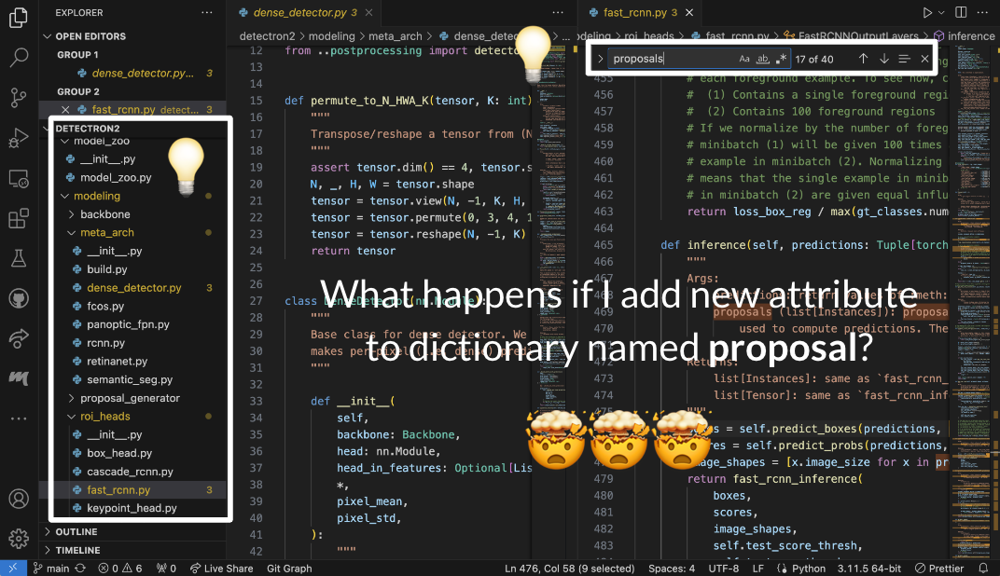
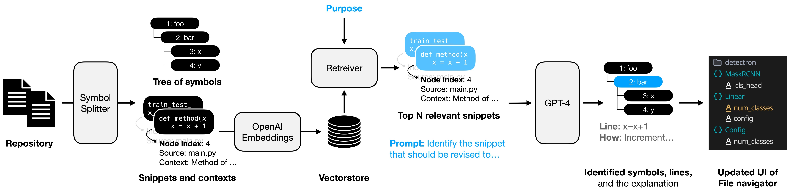

# CodeXplorer: An AI-Assisted Codebase Navigation
## Problem: Large codebases take time to navigate


## AI 


### File structure
- `example1`: example repository including the example tasks
- `code2tree.py`: file including `SymbolSplitter`
- `custom_langchain.py`: custom LangChain classes for code snippet retrieval and retreival augmented generation
- `test_openai.py`: entire pipeline including OpenAI API invokation

### Run the AI pipeline
```
conda activate lam
python test_openai.py
```
You may change two variables.
- `repo_path`: root directory of the repository
- `task`: prompt for task